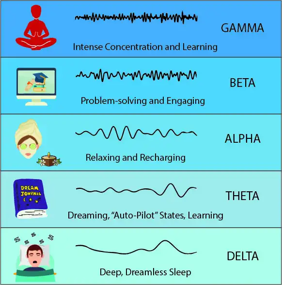

## Chapter 1

https://archive.org/details/JoseSilvaTheSilvaMindControlMethod/page/n13/mode/2up?view=theater

1. A description of typical training session in Mind control.

- Page 18, Para 1

2. What is Alpha, Beta, Theta and Delta state

    

- Page 18, Para 4

- https://archive.org/details/JoseSilvaTheSilvaMindControlMethod/page/n15/mode/2up?view=theater

- Electroencephalograph, EEG

- Page 19, last para 

- Page 20, 2nd Para

- `Beta`: When you are `wide awake`, doing and achieving in the workaday world, you are in Beta, or `outer consciousness`, to use Mind Control terminology. Being in Beta, or `wide awake`, does not produce any one particular feeling. You might feel confident or fearful, busy or idle, engrossed or bored — the `possibilities in Beta are endless`.

- Apha: When you are `daydreaming`, or `just going to sleep but not quite there yet`, or `just awakening but not yet awake`, you are in Alpha. Mind Control people call this `timer consciousness`. 
  
- When you are `asleep` you are in `Alpha, Theta, or Delta, not just Alpha alone`, as many believe. With Mind Control training you can enter the Alpha level at will and still remain fully alert

    

- The mind at a very low frequency `like Delta, Theta or Alph`, we call the mind is at `deeper levels`.

    

1. What is Meditation? 

- Page 19, Para 4

4. 
