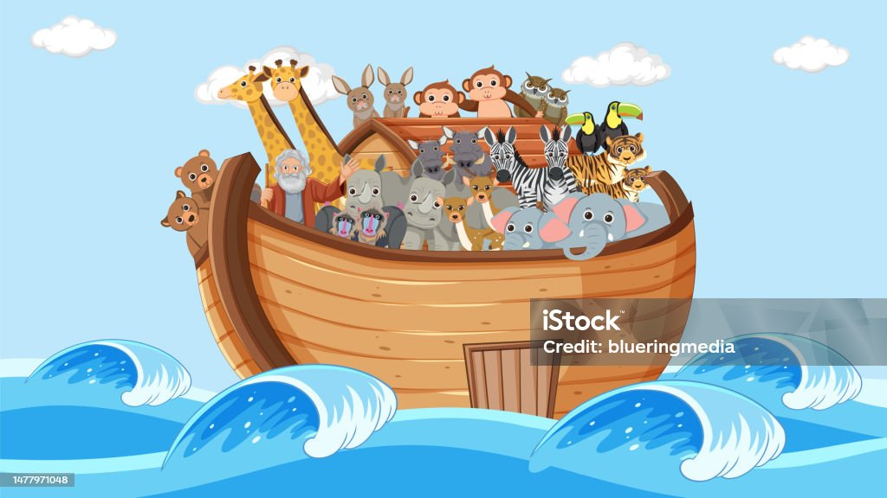

When you have a problem and you want to correct it mentally, you need to transfer it from the `Objective Dimension, the Physical Dimension, to the Subjective Dimension or the Mental Dimension`. You also need to use the correct language, the language of the brain, the language of the mind and the Subjective Dimension. It's not English or Spanish or German, it's visual. Everybody understands pictures, your brain understands pictures, it may not understand every language in the world, but it does understand pictures and your mind understands pictures. 

The universal language that's understood by everybody everywhere, the language that's understood in all dimensions, is visual. The `mental screen`, which we'll learn about next, is a `Communications Tool`. The mental screen allows you to transfer problems from the `Objective Dimension` to the `Subjective Dimension` using `mental pictures` so that you can correct the problems. The `mental screen` is also a means by which you can communicate into the `Subjective Dimension`. You can communicate with your own body effectively by using `mental pictures`. You can communicate with other people with their minds and their brains by using `mental pictures`. You can communicate in this manner with higher intelligence, with our helpers on the other side. You can get information in this manner with the use of your mental screen from wherever that information is stored. 

Before we go any further, let's define some terms so that we're all talking about the same thing, okay? To make sure we understand the words that we're going to be using. First, the word `see`. You `see with your eyes`. That's the only way you can `see` anything with your eyes and your eyesight. 

Now whenever you focus your eyes or whenever you attempt to `focus your eyes`, your brain goes to `20 cycles per second beta`. You can use any of your other senses at alpha, but the `sense of sight requires your brain to be at beta`. Anytime you're looking at something focusing your eyes or attempting to focus, that's beta. 

Next word, `visualize`. Let's talk about what visualization is. `You visualize with your mind`. You don't need your eyesight for that. Now to `visualize simply means that you remember what something looks like`. In order to remember, that means you've seen it before. You've imagined it before you've had some prior experience. `Visualization is memory`, the memory of what something looks like.

`Imagination`, the word imagine, means to think about what something looks like that `you've never experienced before`. Something you've not seen before, something you've not imagined before. `It's a creative process` because what you're thinking about is something that you've never seen or imagined before. 

Now `visualization is not like seeing`. It's not even like dreaming. `It's like remembering`. It's remembering what something looks like. Different people do that different ways with the different level of intensity and different types of mental pictures. 

Let's take an example that uses all of those words, `seeing`, `visualizing`, and `imagining`. Do you remember seeing on television perhaps or in a movie, the dog, Lassie? You have seen a dog before, so recall a dog that you've seen. Lassie will be good if you're familiar with Lassie or if not some dog that you're familiar with. Now do you remember what the dog looked like? If I were to ask you what size is a dog, can you remember how big the dog was? Remember what it looked like? How big it was? How long was the hair? Long hair? Short hair? What color was it? Lassie was what? Blonde, I guess, with some white spots was it? What do you remember when you
saw Lassie? What do you remember about that experience? What about the tail? Recall the tail? Did Lassie have a long tail or was it a little cut off tail? Was it a long tail with a lot of hair? What about the ears? Some dogs have little pointy ears, some have big flopp years. What kind of ears did Lassie have? Remember what they looked like? 

`Now remembering what you have seen before is visualization`. Now if you followed along with me there and did what I asked you to, you've just visualized a dog that you had seen previously. Remember that dog? How many legs did that dog have? How many legs does Lassie have? Do you remember? What three, four legs was it? Remember that one on each corner, right? Basically, you remember what that looks like? Of course you do. 

Now, can you imagine what that dog would have looked like if it had six legs? Where would the other two legs be? Where have you got the four? Where would you put the other two at the front? Give better steering, maybe or better traction? Have that at the back. Somebody said one time you'd have a dual axle Lassie, four legs in the back for better speed, or maybe in the middle to hold up the middle. That's a long stretch there. Maybe they need to two in the middle, or maybe sticking out to the sides so she can corner better. Where would those legs be? Imagine what that would look like. I would be in a little bit silly, but there's a reason for it. So just play along with me, okay? You got the picture there? You know what that would look like? 

Okay, you've just used `imagination` to create a `mental picture of something that you've never seen or imagined before`. It's a very simple thing to do. You can do it with your eyes open or with your eyes closed. `You can do it at beta. You can do it at alpha`. Truth is, we're used to doing it with eyes open with eyes closed various ways of using imagination and visualization. 

Now, in order to imagine things and have a manifest in the physical world, `your visualization and imagination must be at alpha`. For now, that's easiest for you to do with your eyes closed because you shut out distractions. `Later, with practice, you can learn how to function at alpha with your eyes open`, long as you're not focusing on anything, open and defocused. That's an important concept to remember. If you close your eyes and you attempt to visualize something on the back of your eyelids by seeing it, you're trying to use your eyes to form some mental picture, you're going to go to beta. So just remember, you relax, you recall what something looks like. Are you imagine what something looks like? And you can be at alpha and do that. 

Now, let's go back to Lassie again for a moment. Remember that dog, remember Lassie? Or the dog that you were using? And you created an image of a dog with `six legs instead of four`. Where did you finally decide to put those two extra legs? Do you recall the front, the back, the middle? Where was it there? Recall that, recall what that looked like, that mental image that you created. If something had exist only in the mental dimension, not in the physical dimension of that dog with six legs, remember that? Well, now you are visualizing the mental image that you created previously. So we've got our terms okay. 

You see with your eyes, and that's the only way to see. You visualize, which means to remember with your mind and you imagine with your mind, which is a creative process. 

Now, a few people when they do this have very vivid mental images. Most of us, most people have some kind of mental image. Some of us simply know what the dog would look like. That's the way I function. You might say that I imagine what the mental image would be. The good news is, that's all that it takes. It's all that's required to be successful in your functioning and the `subject of dimension`. Thank goodness for that. 

Now you want to get accustomed to thinking about what things look like. Some people use words and think things through. Others use feelings. These are all good. These are all important. It helps us with our programming and we'll talk about that more as we get into the programming techniques. But it's also important, especially for `mental functioning` and the `subject of dimension`, that you think visually as well. Visual is a primary means of communication in this dimension. So you want to get used to thinking visually to visualize and imagine what things look like. This is important when you use a programming technique like the `mirror of the mind`, which you'll learn a little later. It's important because you `first must visualize what the problem is that you desire to correct`. Then you must `imagine the problem corrected`. `Imagine your goal reaching your goal`. 

Now, yeah, since that's so important, how would you like to have a `technique that would help you develop and improve your ability to visualize and imagine on your mental screen?` We have a technique to do that and there's an added bonus to it. Mr. Silva loves to get techniques that have multiple purposes, multiple benefits. His `same technique will also help you to improve your memory`. For a bargain, two benefits for the price of one. 

Well, first, let's define the `mental screen` and show you how to `locate your mental screen`. Your mental screen can be like a surround movie screen or a giant 360 degree computer screen. It'll be upwards out and away from your body. Say about, imagine about 30 feet in front of you. Imagine there's a screen about 30 feet in front of you that you can look at. And it's upwards about 20 degrees above the horizontal. Enough where you have to turn your eyes upward, but not so high that they're uncomfortable. You don't want to be uncomfortable when you're functioning. Turning your eyes upward seems to increase alpha output. Now, this screen doesn't have to be just in front of you. It can wrap around to the sides. It can wrap around 360 degrees so you can be aware of everything all the way around if you choose to. You'll be able to project and detect images on the screen behind you off to the sides wherever you need to. 

Okay. Now, here's how we'll program it in the `conditioning cycle`. We'll say something like this. To locate your mental screen, begin with your eyes closed, turn slightly upward from the horizontal plane of sight at an angle of approximately 20 degrees. The area that you perceive with your mind is your mental screen. Without using your eyelids of screens, sense your mental screen to be out away from your body. To improve the use of your mental screen, project images or mental pictures onto the screen, especially images having color. Concentrate on mentally sensing and visualizing true color. So, you do this with your eyes closed and turn slightly upward. Imagine a screen out and away from you. 

This is where you're going to `project imagery or to detect information` when you visualize and imagine on your mental screen. `Mental screen is to transfer from one dimension to the other, from one aspect to the other, where you're receiving or transmitting` a shows on your mental screen. So, `to transmit something with your mental screen, you project it to your mental screen`. `To detect it, you sense it on your mental screen`. 

Well, all right, let's get to the technique that will help you improve the use of your mental screen to help you visualize and imagine better. We'll learn a portion of a memory course. Using visualization, imagination and association makes it easier to remember things. You know, we all have perfect memories. `It's our ability to recall that sometimes it's a little bit faulty`. We tend to remember things that we associate with having a good time. Isn't that true? If you think about it, think back to when you were young. Perhaps you remember a Christmas, where you got a wonderful Christmas present, something you really wanted or a birthday, when you got just what you wanted or had a great party. People tend to remember things like that. We tend to remember our things like our first date, a senior prom. If it's a memorable event, then we remember it. 

Well, if we want to remember a list of, say, 10 items that we need, then we need to make a memorable somehow. We'll show you how this works. You can remember a list of objects. We'll do 10 for now. Usually in class, we do 30, but here we'll do 10. You can remember as many as you want to. Here are the steps involved. 

First, you get a good mental image of the object that you want to remember. 
Second, you associate that object that you want to remember with something that you already know that you're already familiar with, and you do it in a memorable way. That's like having a peg to hang your picture on. Now, we can list them. We say, okay, we'll remember 10 object. Object number one is so and so, but a number is not very good. It doesn't give you a real good picture. It's not a real good peg to hang it on. If we want something better than that, we're going to use pictures as pegs as well. Now, let's run through and I'll show you how it works, and then I'll explain how it works so that you can do it yourself whenever you want to. For now, I'll provide the pegs for you to hang your mental pictures on. Later, I'll show you how to remember the pegs so that you can have as many list of items as you're memory as you desire.

So, let's pick some items to remember. Let's say the first item you'd like to remember is a book. There's a new book that we've just finished. It's called a Selva method, think and grow fifth. Mr. Selva and I put together. It's everything you want to know about mental training for fitness and for sports. Now, get a picture of a book and it got that in your mind, a good picture of a book. Now, we want to associate that with what will always be our peg for number one. `Anytime we have number one, the peg will be, the peg word will be T, like a glass of tea, okay?` A glass of iced tea. Now, the object is to associate the object, the book, in some memorable way, something that's humorous or exaggerated or funny or unusual with the glass of tea. Imagine if you went into a restaurant to have lunch in your order to glass a tea with your lunch and you get your glass of tea and what do you see on the tea, along with all the ice cubes, little miniature copies of the Think and Grow Fit book bouncing around. You'd remember that, wouldn't you? Create a mental picture now. Can you imagine what that would look like? Imagine what that looks like, a glass of tea with Think and Grow Fit books in there, floating around. You'd remember that, okay? 

The second object we want to remember, well, everybody needs a car. Let's have a car. Now, it's interesting because the more details you remember, the easier it is to recall it later. So, let's make this car red, convertible, a sports model, but it does have a back seat, okay? Sports model. So, you've got your spouse, your girlfriend, your boyfriend, and the front seat with you, and maybe some kids in the back seat. Okay, you got a picture of that car. What kind would you like? Get a good picture of that car. Now, `the peg word for number two will always be Noah.` That will not change. It'll always be Noah. Remember Noah in the Ark, a man with a white robe and a long white beard. Well, how can we make that memorable? Let's imagine Noah guiding all the animals on to the Ark two by two, and here he's got these two red sports cars, convertibles at the topstown, going up the gang plank on to the Ark. That's something that you'd probably remember. 

Number three, let's take a vacation. Let's go to a sunny island on the Pacific, sitting under the shade of a palm tree, drinking with those cool coconut drinks. Oh, can you imagine what that would look like? Imagine yourself do it. Can you just picture that happening? Play along here. Picture that happening. Maybe you're not planning to right away, but get a picture of it, okay? `Now, number three, the peg word will always be May, the calendar month of May.` So, on a calendar, there's always this big, beautiful picture. We've got a three-dimensional, like a holographic picture. It just comes right off the calendar and a stand right there. What's the picture? Your vacation out on this beautiful Pacific island, sitting under the palm tree, drinking the cool coconut drink. Keep that in mind. Remember that. 

Let's go back and check and review just to make sure we got it, right? peg number one is always the glass of tea. Now, you get the glass of tea. What's in the glass of tea? Did you make a good mental picture of it? Remember the think and grow fit books floating around the glass of tea? Get a good picture of it. Number two, Noah. The peg word is always Noah. Man with a long white beard, and he's guiding two of our objects onto the ark. What's going up onto the ark now, along with all the animals? Remember the red sports car. Three, the peg word is always May, the calendar month of May. And what's the picture on the calendar? That wonderful vacation you're having. Where's that vacation? The Pacific island. What are you doing? You're sitting under what a pine tree. Noah palm tree. What are you doing? Drinking a cool drink. Get a good picture of it. 

Number four, well, we need money to pay for it. So let's get some money. Let's get a stack. We have to picture the money, right? A specific picture of what we want. Let's get a stack of $100 bills. Okay. You know what that would look like? Big stack. Maybe several stacks of $100 bills. So you have enough money for the vacation and the car and everything else. All righty. `Now, number four is Ray. Ray's of sunlight. Four rays of sunlight shining down `on these $100 bills. Oh, you'd remember that, wouldn't you? They're heating up the bills, lighting them up. The bills are just fluttering up and down on the rays of light. Okay. 

Number five, let's get us a house. Everybody needs a house. This house will be a white brick house with a red roof. It's a two story house. Okay. You got the picture of that. Beautiful landscaping out in front. Can a picture of this beautiful white brick house with a red roof, two stories tall. `The peg word for five is law. The law man guarding the house.` He's standing out in front, stopping intruders from coming in. So associate the law man with the house. 

Number six, how about a big TV? One of those really big screen, projection screen, 60 inch picture, surround sound. Got the picture of the TV. Okay. The` peg word for number six will always be jaw a man with a large jaw.` So it can be balancing the object. In this case, a TV on the jaw could be like a big professional wrestler or something. I always like to think of the big man with a large jaw chewing, just using that big jaw to eat up whatever it is. Any picture that's memorable, keep it interesting. 

Number seven, for a little fun, let's get a motorcycle. Big old Harley Davidson, you know, the big hog white maroon. Okay. Got the picture of the big motorcycle. `Peg word for seven is always key`. A large go key. How can we associate a large go key with the Harley using the key to turn it on or maybe using the key to wind it up? That's what makes it go. It's got a wind up motor on it. Okay. Make a picture that you could remember. So when you think of the key, what's it doing? What's it winding up? All the Harley Davidson motorcycle. 

Let's go back and review again. Number four, which rays of light. Remember the rays of light? What's the object associated with that? Stack a hundred dollar bills. Remember, in the bills, fluttering up and down in the light. Number five, the peg word is law, the law man, the police man. What's a policeman doing? Gardening your house, the big white brick two-story house with the red roof. Number six, the man with a large jaw. What's this man with a large jaw doing with that large jaw? The projection screen, 60-inch picture, surround sound, televisions set. And number seven, the large go key, associated with the Harley Davidson motorcycle, white maroon 

`Remember, get a good picture of it. Think in colors, exaggerate, make it weird, funny, strange. `

Number eight, cowboy boots. Let's have cowboy boots for number eight, okay? Black rattle skin, rattlesnake skin boots. `Number eight, the peg word will always be fee`, a fee of eight million dollars. Imagine if you saw some cowboy boots worth eight million dollars. Can you imagine that? You'd remember a great big price tag of eight million dollars on those black rattlesnake skin boots. You'd remember that. 

Number nine, what about a great diamond ring? Let's make that the object for number nine. A diamond ring with a very large stone in it, a gold band little pearls all around the stone. `Now the peg word for nine is always bay, land and water` like San Francisco bay. The golden gate bridge goes across that. You got all kinds of imagery you can have there. So we have the bay, what, filled up instead of sailboats and motorboats out in the bay and yachts and things. It's filled up with these great big gorgeous diamond rings. 

And number 10, let's have a computer. Computer, one of those tower systems with a gigabyte of storage, all the trimming's big color monitor, mouse and everything and keyboard. `The peg word for 10 will always be toes`. So you got the picture of the computer. How are you going to associate your 10 toes with the computer? Maybe your toes are operating the mouse. That's something you'd remember, isn't it? 

Okay, see the last three then, the fee of eight million dollars. What is it cost eight million dollars? Big old rattlesnake skin cowboy boots. Number nine is the bay, land and water like San Francisco bay. What's filled up? What is it filling up the bay? These big beautiful diamond rings. And number 10, your 10 toes, what are you doing with your toes? You're operating the computer. 

Now you can go back, I'm sure and recall those easily. Number one, the glass of tea, what's in the tea? Number four, the rays of light. What's fluttering up and down the rays of light? Number seven, a large gold key associated with what? If you have any trouble remembering, back up and play this again, do you get the hang of just how that's done? 

That makes it easy to remember a list of objects. See how simple that is when you have a peg, when you make it interesting? 

So the question is, how do we remember the pegs? How do you remember the peg words? Mr. Silva got this memory peg system from a course by a man named Bruno first. If you want to know more about it and other ways to improve your memory, check out the books by Bruno first or a more modern author with that is Harry Lorraine using essentially the same system. What we do here with the memory peg system is convert numbers to letters, specifically to consonants. And then we use the letters to help us form the names of objects that we can remember and use as our pegs. The pegs never change, only the list of things to remember changes. Since our number system is a decimal system, once we learn the first 10 peg, once it represents the numbers 1, 2, 3, 4, 5, 6, 7, 8, 9, and 0, then we can make any other number out of combinations of those. `So numbers represent letters, letters represent numbers.` Consonants are talking about. Vowels have no value, they're just used to fill in. This system is designed to make it as easy as possible to remember the first 10 pegs. 

For instance, the number 1, how can we convert that to a letter very easily to a consonant? Well, if you put a top on it, just put a top, just draw a horizontal line across a top and you have a T. 

So number 1 becomes a T. The consonants that we used are based on the phonetic sound. That is, if your teeth, your tongue, your lips are in the same position, it has the same value. Like the letter is T and D. Say those out loud, you'll see what I'm talking about. The letter T, say T, now say D, notice your tongue is in the same position, your lips are the same. So they have the same value, they are interchangeable. B and P are also the same.
If you say those two, B, P, notice how your lips, your tongue, your teeth are the same. So vowels have no value, only the consonants. Vowels are used to fill in and make words. So if the number 1 is always a T or a D, let's start with a T, that's more common, and use our vowels to make a word, A-E-I-O-U. The E works out real good, they're done to make it T, T-E-A, or T-W, it could be a golf T, but we'll use a glass of T, okay? 

Number 2 will always be represented by an N. If you write a 2 and turn it over on its side, it looks like an N. Our printed N, like on a typewriter, has two legs, two down strokes. 

Number 3 is always represented by an M. If you take a 3 and write it on a piece of paper and turn it over, it looks like an M. If you turn it the other way, it looks like a W, but we turn it so it looks like an M. It makes it a little easier to remember that number 3, let it fall down, it looks like an M. Our, again, a printed M, has three legs, three down strokes. 

Number 4, the fourth letter, the four letter word 4, F-O-U-R is a letter R, so R will always represent number 4. 

Now remember to convert these two peg words, we simply add vowels, so number 2 N, N-O-A, and the H is silent NOAA.
3, let's use a vowels A, E-I-O-U, M-A, M-A-Y, M-A-Y, Y has no value.

Number 4 can rhyme with M, R-A, just do the same thing.

Number 5, remember the Roman numeral for 50 was an L, so who will use L for our consonant that will always represent 5, so L, L-A, and the W has no value, L-A-W, so we can go ahead and use that, okay? The W, the H, and the Y have no value in this system either, even though they're consonants, they still have no value, so we use them the same as we would vowels.

Number 6, if you take a 6 and don't quite write it all the way around and don't quite hook up that bottom part and turn it around or hold it up to a mirror, it'll look like a J. 

A 7, if you let it lean up against a wall and look at that in a mirror, it looks like a K.

Number 8 has a loop at the top and the bottom, just like the written F, has a loop at the top and the bottom. 

The number 9, if you flip it over upside down, looks like a B, a lower case or a little B. 

And for the number 10, that involves two numbers, first is the 1, which is always a T or a D, so it'll be a T. And the second for the 0 could be the Z sound or the S sound, that hissing sound can come out for the 0. If you start to write a 0, but you stop halfway and reverse yourself, you can make an S. 

Number 6 is a J, A-I-O-U, J-A, J-A-W, has no value, J-A, number 7 is a K, K-A, no, K-E-K, K-E-Y could be a K, number 8 is an F, or could be the V sound, like an U, sounds like an F, an F for number 8, A-E-I-O-U-F-E, like a V, number 9 is always a B or a P, we'll use a B, A, B, B, B would be 99, because there are two B's. And 10 is a T and an S, T-A-T-O-T-O-S-T-O-E-S, toes, we could have toes, okay? Now, you can remember several lists of objects at one time, believe it or not, you don't have to stop there at just one list. I knew a lecturer once in Florida who used to do three intros a day and then start class the next night and he was teaching about three classes, almost three classes a month on average, and then he would demonstrate the memory pegs in the intro. Then in class, he would say, now you were at the morning intro, and number 6, the object was, so and so, he could remember all these different lists. 

It's amazing what your brain is capable of doing, what your mind is able to do, if you just set your mind to it and you determine to do it. Now, you can remember as many as you want to, numbers above 10 are just combinations. The number 26 would be a combination of the 2, which is always an N and the 6, which is always a J, or the J sound, that could be a niche, a niche, like a little hole in the wall or something, okay? 37, a 3 would always be an M, a 7 would always be a K, so that would be a word that has an M followed by a K filled in with vowels, like a mic, like a microphone, see how it works. Now, if you improve the use of your mental screen with visualization, that helps to enhance the imagination, the memory, and clairvoyance. `Our goal is clairvoyance`. The individuals who put this system together found a solution for memory work. Our objective is not to give you a memory course, but to give you something to work with that's used in memory courses that will also enhance the use of the mental screen, so that you can be a better clairvoyant. That is, of course, what we use or visualization and imagination. If you really want to choose success, you'll practice the memory pegs. We're putting the power in your hands, the power to choose success. You can choose to practice the memory pegs, or not? It's up to you. If you want to improve your communication skills in the subject of dimension, the mental dimension, you will choose success, you will choose to learn and practice the memory pegs. 

Now, this conditioning is along when it's almost 20 minutes long. In the conditioning cycle, we'll go through the first 10 memory pegs with you, and then we'll go through the pegs along with the objects that you're going to remember, so we'll impress them at level to make it easy for you to remember. Then in the future, you can go ahead, you can practice, you can practice making up shopping lists, appointments, or to-do lists, whatever you want to using the memory pegs. Remember, the pegs always stay the same, so that's what you'll use. So, impress them now at your level, take the time to learn them. It'll be well worth your time for it. When you're ready to go to level, then make yourself comfortable, find a comfortable position, and we'll find out what a super power memory you have, develop that, and also develop the tools you need for programming and to be a great clairvoyant. Thank you.

