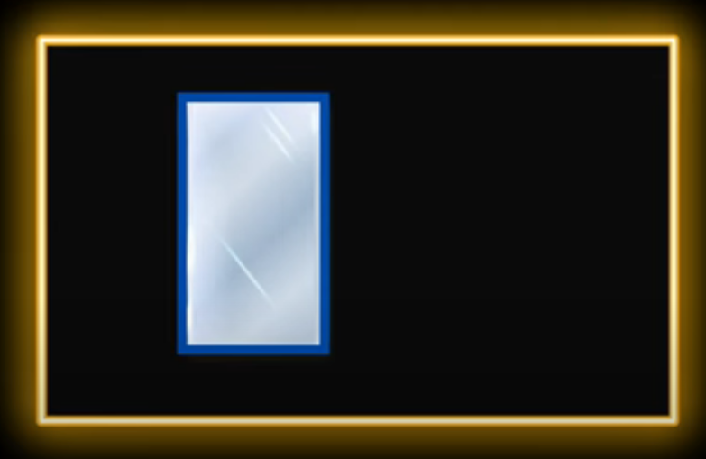

## Notes
1. This is an important one. 

2. Used to correct problems and reaching your goals.

3. Uses visualization and imagination

4. Thing or Things, a Person or persons, a small scene or a large scene

5. Blue to white
   1. Blue - Problem
   2. White - Solution

6. See Ref 2 below.

7. Guilt. Is a feeling of remorse or regret for wrongdoing, often accompanied by a sense of responsibility for a negative outcome. The fact of having committed a specified or implied offense or crime.

8. `Restitution` refers to the act of restoring something to its original state, returning something to its rightful owner, or making compensation for a loss or injury. It can involve the return of stolen property, payment for damages, or other forms of compensation to make things right after wrongdoing. 

9. Three questions you need to ask yourself when you are suffering from guilt.
   1.  First of all, have I done whatever I can to make `restitution`?
   2.  Have I learned anything from the mistake that I made?
   3.  Have I made a commitment to not to repeat the same mistake again?

10. If you feel guilty, that means 
    1.  You don't like yourself. 
    2.  You don't trust yourself. 
    3.  You don't trust your judgment and what you're doing.

11. Disdainful means expressing strong dislike or contempt for something or someone considered unworthy of respect. It implies a feeling of being superior and looking down on others. The word suggests a negative attitude of scorn and disrespect. 

12. If it takes increasingly longer time to solve problems one after another, then it means that you are going in a wrong direction. 

## References
1. https://www.youtube.com/watch?v=8NmriaMUpuI
2. https://youtu.be/z7GuFpuWEMo?t=86
