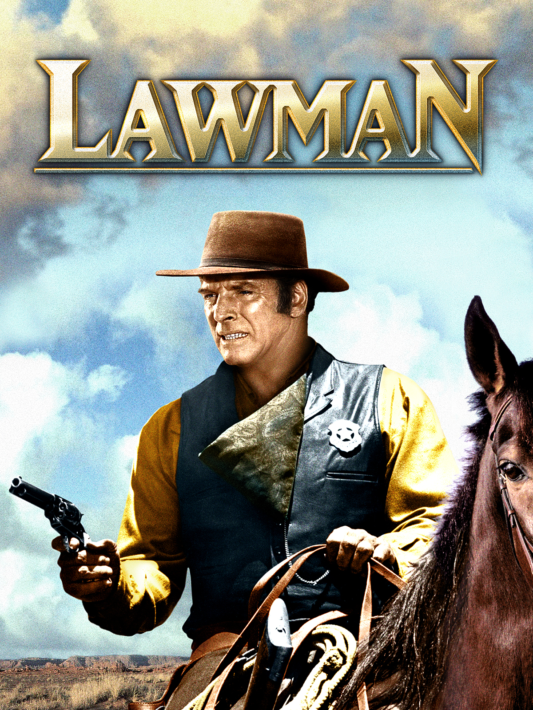
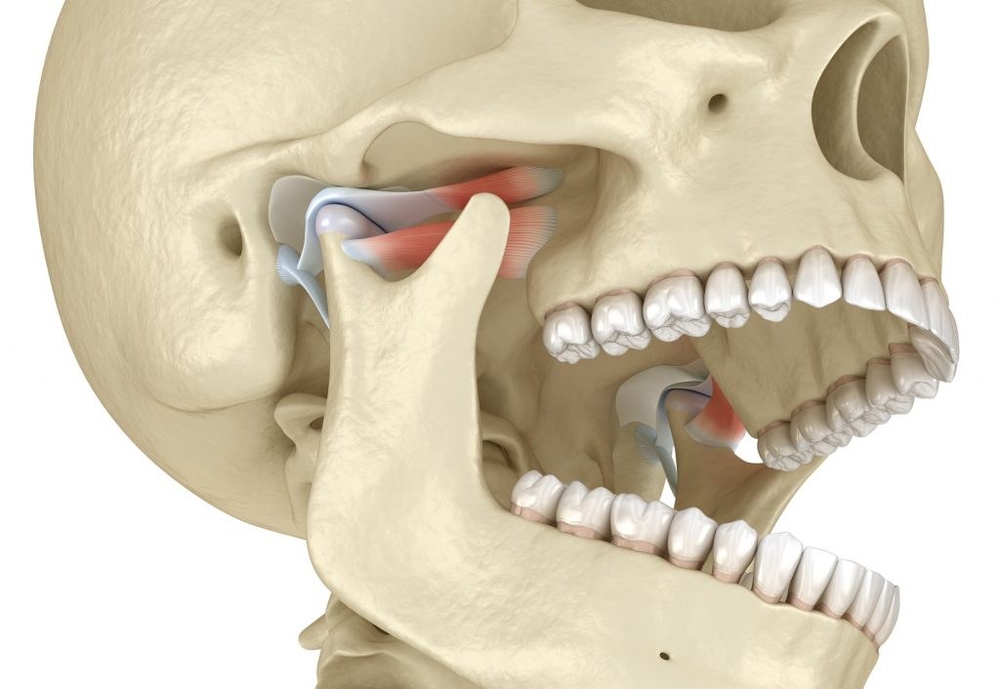
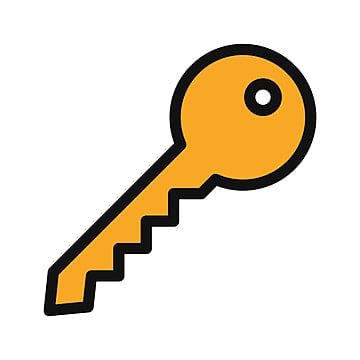
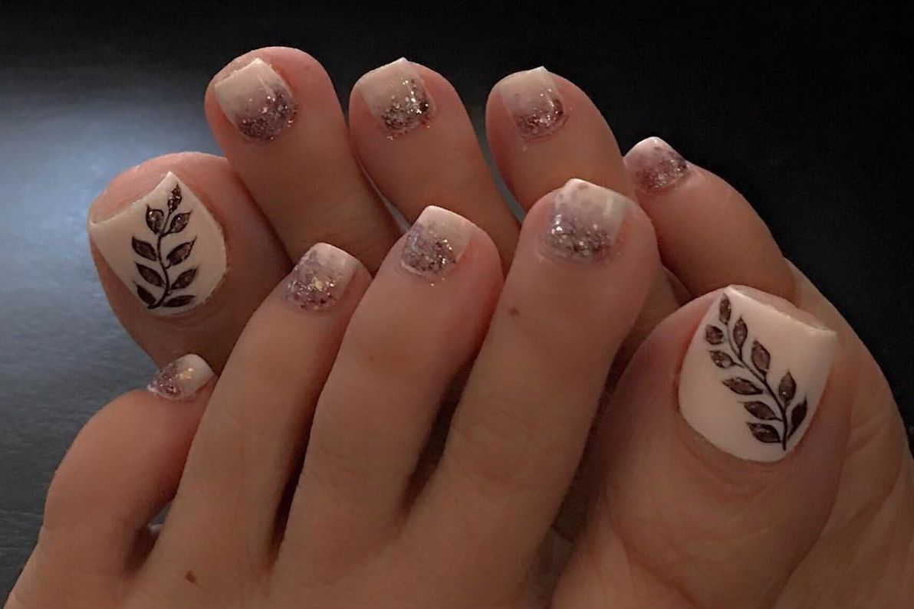

https://artofmemory.com/blog/peg-lists/

one - gun
two - shoe
three - tree
four - door
five - hive
six - sticks
seven - heaven
eight - bait (for fishing)
nine - wine
ten - pen

For instance, the number 1, how can we convert that to a letter very easily to a consonant? Well, if you put a top on it, just put a top, just draw a horizontal line across a top and you have a T. 

So number 1 becomes a T. The consonants that we used are based on the phonetic sound. That is, if your teeth, your tongue, your lips are in the same position, it has the same value. Like the letter is T and D. Say those out loud, you'll see what I'm talking about. The letter T, say T, now say D, notice your tongue is in the same position, your lips are the same. So they have the same value, they are interchangeable. B and P are also the same.
If you say those two, B, P, notice how your lips, your tongue, your teeth are the same. So vowels have no value, only the consonants. Vowels are used to fill in and make words. So if the number 1 is always a T or a D, let's start with a T, that's more common, and use our vowels to make a word, A-E-I-O-U. The E works out real good, they're done to make it T, T-E-A, or T-W, it could be a golf T, but we'll use a glass of T, okay? 

Number 2 will always be represented by an N. If you write a 2 and turn it over on its side, it looks like an N. Our printed N, like on a typewriter, has two legs, two down strokes. 

Number 3 is always represented by an M. If you take a 3 and write it on a piece of paper and turn it over, it looks like an M. If you turn it the other way, it looks like a W, but we turn it so it looks like an M. It makes it a little easier to remember that number 3, let it fall down, it looks like an M. Our, again, a printed M, has three legs, three down strokes. 

Number 4, the fourth letter, the four letter word 4, F-O-U-R is a letter R, so R will always represent number 4. 

Now remember to convert these two peg words, we simply add vowels, so number 2 N, N-O-A, and the H is silent NOAA.
3, let's use a vowels A, E-I-O-U, M-A, M-A-Y, M-A-Y, Y has no value.

Number 4 can rhyme with M, R-A, just do the same thing.

Number 5, remember the Roman numeral for 50 was an L, so who will use L for our consonant that will always represent 5, so L, L-A, and the W has no value, L-A-W, so we can go ahead and use that, okay? The W, the H, and the Y have no value in this system either, even though they're consonants, they still have no value, so we use them the same as we would vowels.

Number 6, if you take a 6 and don't quite write it all the way around and don't quite hook up that bottom part and turn it around or hold it up to a mirror, it'll look like a J. 

A 7, if you let it lean up against a wall and look at that in a mirror, it looks like a K.

Number 8 has a loop at the top and the bottom, just like the written F, has a loop at the top and the bottom. 

The number 9, if you flip it over upside down, looks like a B, a lower case or a little B. 

And for the number 10, that involves two numbers, first is the 1, which is always a T or a D, so it'll be a T. And the second for the 0 could be the Z sound or the S sound, that hissing sound can come out for the 0. If you start to write a 0, but you stop halfway and reverse yourself, you can make an S. 

Number 6 is a J, A-I-O-U, J-A, J-A-W, has no value, J-A, number 7 is a K, K-A, no, K-E-K, K-E-Y could be a K, number 8 is an F, or could be the V sound, like an U, sounds like an F, an F for number 8, A-E-I-O-U-F-E, like a V, number 9 is always a B or a P, we'll use a B, A, B, B, B would be 99, because there are two B's. And 10 is a T and an S, T-A-T-O-T-O-S-T-O-E-S, toes, we could have toes, okay? Now, you can remember several lists of objects at one time, believe it or not, you don't have to stop there at just one list. I knew a lecturer once in Florida who used to do three intros a day and then start class the next night and he was teaching about three classes, almost three classes a month on average, and then he would demonstrate the memory pegs in the intro. Then in class, he would say, now you were at the morning intro, and number 6, the object was, so and so, he could remember all these different lists. 

## The Number pegs as explained in the audio pegs

Number one, the letter T, the peg word T, project a strong picture of a glass of T on your mental screen.
Number two, the letter N, the peg word NOAA, project a picture of a man with a long white beard on your mental screen.
Number three, the letter M, the peg word MA, project a picture of a calendar on your screen.
Number four, the letter R, the word RA, mental picture sun rays.
Number five, the letter L, the word L, mental picture, a policeman.
Number six, the letter J, the word J, mental picture, a man with a large jaw.
Number seven, the letter K, the word K, mental picture, a large gold key.
Number eight, the letter F, the word F, mental picture, a price tag of eight million dollars.
Number nine, the letter B, the word B, mental picture, land and water.
Number ten, the letters T and S, the word Toes, mental picture, ten Toes.

## Refernces
1. What is Visualization?
   1. https://www.youtube.com/watch?v=i_Cjv0URDSg
   2. Jose Silva explains how to improve learning ability
2. 