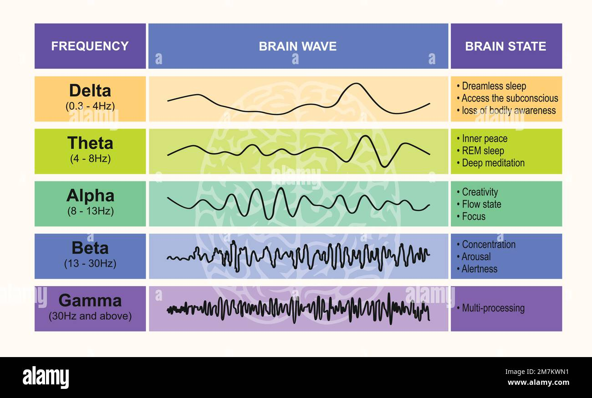

In this next mental exercise, you'll learn two new techniques. The first is a new way of entering level, an additional way from what you've already learned, and it allows you to enter a very, very deep level of mind also. The second technique is a first aid technique that you can use whenever you're hurt, whenever you have an injury, whenever you need to accelerate the healing process.

You have a couple of ways of knowing that you're really at your alpha level

Entering your level with hand levitation till `theta brainwave level`.

At theta, your subconscious will take over.

And it'll come up by the use of your imagination. 
