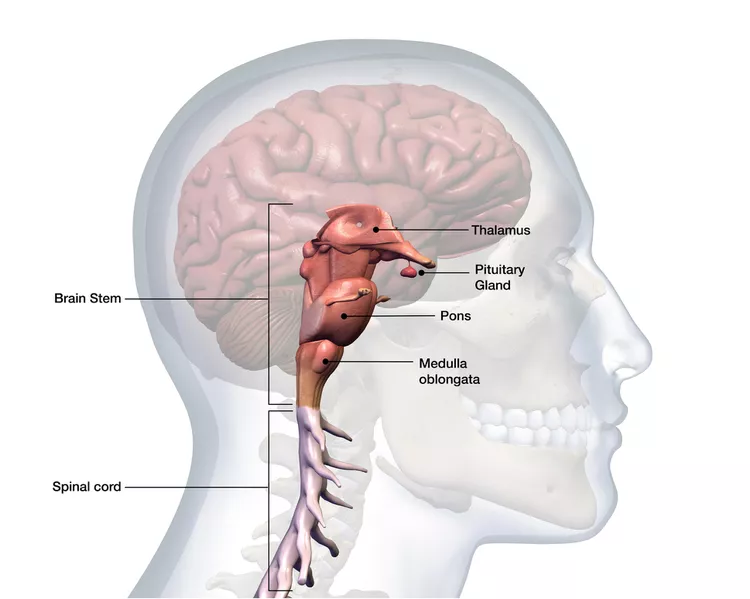
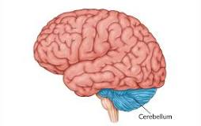
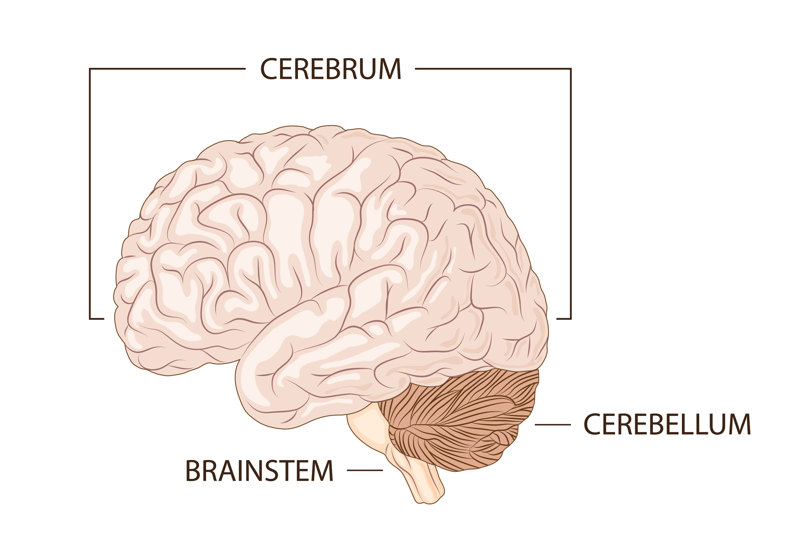

1. The brain is part of the central nervous system (CNS). 
   1. Similar to the control tower at an airport
   2. Acts as its control center, directing all the comings and goings of information, processes, and impulses
   3. The brain has three major areas: 
      1. the brain stem,
        
      2. the cerebellum, 
        
      3. and the cerebral cortex(the brown one in the above). Both the cerebellum and cerebral cortex start with cere, Latin for "wax" because of its waxy appearance. 
        
   4. The brain is made of fat and water
   5. Weighs approximately three pounds
   6. 
2. 